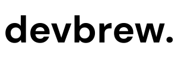

AI engineering firm for B2B startups. We build AI agents, LLM integrations, and intelligent automations that become part of your product. This is the source for [devbrew.ai](https://www.devbrew.ai).

## Tech Stack

- Next.js 15 (App Router), React 19, TypeScript
- Tailwind CSS 4
- Contentlayer2 + MDX for content
- Pliny utilities (search, MDX renderer, TOC)

## Local Development

```bash
bun install
bun run dev          # Start dev server at localhost:3000
```

## Build & Deploy

```bash
bun run build        # Production build (Contentlayer + RSS generation)
bun run serve        # Start production server
bun run lint         # ESLint with auto-fix
bun run analyze      # Bundle size analysis
```

## Site Structure

| Page        | Route          | Purpose                                         |
| ----------- | -------------- | ----------------------------------------------- |
| Home        | `/`            | Hero, capabilities, featured work, process, CTA |
| Work        | `/work`        | Portfolio of projects                           |
| Services    | `/services`    | What we build, pricing, how we work             |
| Blog        | `/blog`        | Insights on applied AI                          |
| Get Started | `/get-started` | Contact form (redirects to `/contact`)          |

## Content

Content lives in `data/` as MDX files:

- `data/blog/` — Blog posts (served at `/blog`)
- `data/work/` — Work/portfolio items (served at `/work`)
- `data/authors/` — Author metadata

Frontmatter structure:

```yaml
title: 'Article Title'
date: '2025-12-26'
tags: ['ai', 'startups']
summary: 'Brief description'
authors: ['joe-kariuki']
images: ['/static/images/blog/slug/og.png']
layout: PostLayout
draft: false
```

- File names use kebab-case and become URL slugs
- Set `draft: true` to hide from site, sitemap, and RSS
- OG images go in `public/static/images/blog/<slug>/og.png`

## Key Directories

```
app/          — Next.js App Router pages and API routes
components/   — React components (ui/ contains shadcn components)
layouts/      — Article layouts (PostLayout, ListLayout, CardListLayout)
modules/      — Feature modules (home, contact, services)
data/         — MDX content and site configuration
css/          — Tailwind CSS with design tokens
scripts/      — Post-build and RSS generation
public/       — Static assets and generated search index
```

## Environment Variables

See `.env.example` for typical values. Common areas:

- Analytics (Umami)
- Comments (Giscus)
- Newsletter (ConvertKit)
- Email (Resend — for contact form)

## Links

- Website: https://www.devbrew.ai
- GitHub: https://github.com/devbrewai
- LinkedIn: https://www.linkedin.com/company/devbrewco
- X: https://x.com/devbrewai
