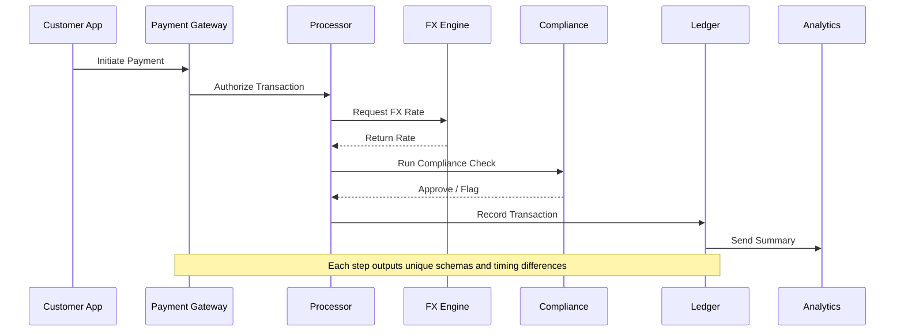
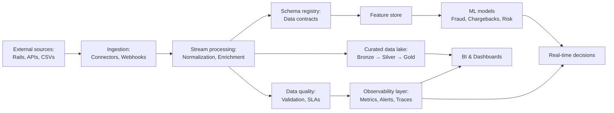
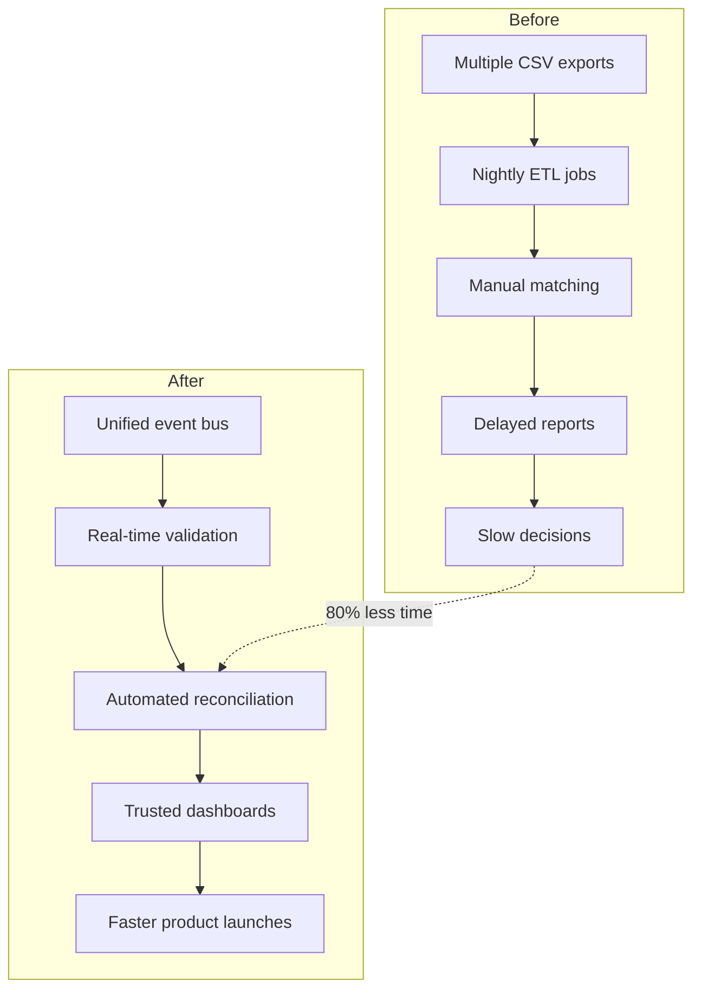

In cross-border payments, data chaos is the norm. Fragmented systems, missing context, and delayed insights slow everything down.

This post explores why most payment teams struggle to build reliable data pipelines and how AI-driven observability can turn data friction into flow.

---

## **Why data chaos slows every cross-border payments team**

If you've ever tried building a data pipeline for a cross-border payments platform, you know the pain.

Your data lives everywhere: card processors, mobile wallets, bank APIs, FX providers. Each has its own format, latency, and reliability issues. You spend half your time fixing broken ETL jobs and the other half waiting on CSV exports from partners who "don't have an API yet."

By the time analytics or compliance dashboards are up, the insights are already outdated.

The truth is most teams don't have a data problem. They have a design problem. They build for output before they build for observability.

That's the silent killer of velocity in fintech.

Here is what that fragmentation looks like in practice:

Each system introduces its own schema and timing differences, which compound downstream, leading to slow reconciliations and delayed insights.

---

## **The hidden design flaw behind unreliable data pipelines**

Cross-border payments are messy by nature. Every transaction passes through multiple systems: issuer banks, processors, gateways, FX engines, and compliance checks. Each introduces its own data schema, format, and timing.

Here's what typically happens:

- Founders prioritize launching new features over instrumenting data collection early.
- Product teams rely on third-party APIs without standardizing or validating inputs.
- Analysts try to bolt on dashboards later, but by then, data integrity is already compromised.

It's like trying to build an airplane mid-flight while passengers are already onboard.

AI can change that. Instead of reactive data cleaning and patchwork integrations, AI-driven observability systems can continuously learn from your data flow. They can detect inconsistencies, auto-map schemas, and flag anomalies in near real time.

Imagine having a self-healing data pipeline that grows smarter with every transaction.

Below is what an AI ready data pipeline looks like:

This pipeline ensures every data stage, from ingestion to decision, is measurable, monitored, and explainable.

---

## **How AI-driven observability changes everything**

Now picture this:

Your entire transaction flow, from onboarding to settlement, lives in a single unified, AI-ready pipeline. No more CSV stitching or overnight reconciliations.

- Reconciliation time drops by **80%**.
- Product teams can ship and test features faster.
- Compliance teams get real-time visibility instead of postmortems.
- Leadership gets trusted dashboards that drive faster decisions and shorter time to revenue.

Here is how the workflow changes before and after AI observability:

AI observability transforms reconciliation from a nightly process to an always-on capability, unlocking speed, trust, and growth.

---

## **Moving from reactive to proactive architecture**

If your payments data feels scattered and slow, it's not a tech stack issue — it's an architecture issue.

Start by auditing your current pipeline.

Ask yourself:

- Can your system trace a transaction from initiation to settlement without manual lookup?
- Do you know where data loss or duplication might be happening?
- Is your analytics layer fed by real-time, verified events or stitched-together reports?

At Devbrew, we help payments companies build unified, AI-ready data pipelines that make insights instant and operations faster.

If you're ready to move from reactive to proactive data architecture, let's talk.

[Book a call](/contact) and see how we can help you reclaim your data velocity.
