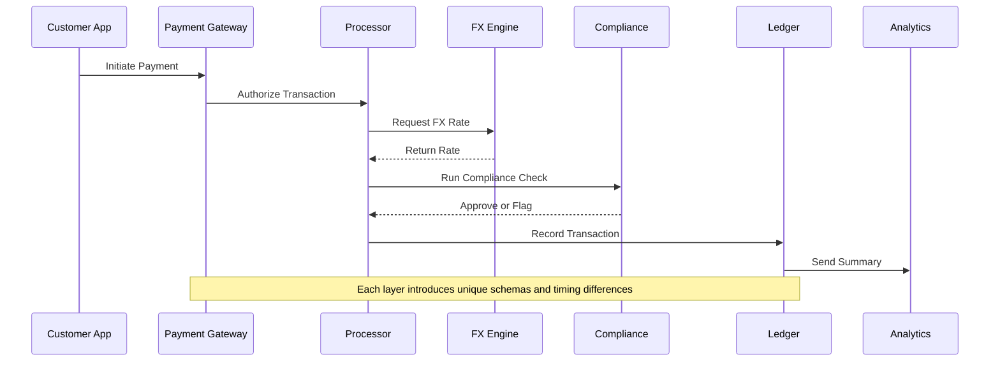
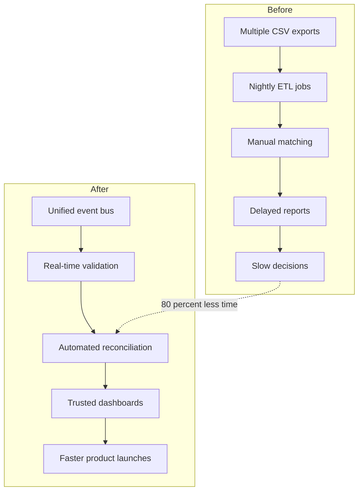

In cross border payments, data chaos is normal. Systems do not agree and schemas drift without warning, so insight often arrives late. If you have felt reconciliation slowing down as volumes grow, this is usually why.

This post breaks down why most payments teams struggle to build reliable data pipelines and how an AI ready observability layer turns scattered data into a single source of truth.

---

## **Why data chaos is the default in cross border payments**

If you have ever tried to build a clean pipeline for a cross border platform, you already know the pain.

Your data sits across card processors, mobile wallets, bank rails, FX providers, and internal ledgers.
Each source has its own timing, reliability, and structure.
You spend hours fixing broken ETL jobs, chasing missing fields, and waiting for CSV exports from partners who still do not have an API.

By the time your dashboards are updated, the picture often feels stale and incomplete.

Most teams assume they have a data problem when the real issue is usually design.

They build for output before they build for observability.

That silent flaw slows reconciliation, compliance, and product experimentation across every corridor.

Here's what that fragmentation looks like in practice.

Even small timing differences compound downstream, creating reconciliation delays and inconsistent reporting across teams.

---

## **What payments teams usually get wrong**

Most cross border payments teams make the same mistakes when they scale their data infrastructure.

- They rely on partner APIs without validating structure or completeness.
- They collect raw events without contracts, which guarantees schema drift.
- They treat reconciliation as a reporting problem instead of an architectural one.
- They add analysts instead of adding instrumentation.
- They default to batch ETL even when parts of the transaction flow would benefit from a real time stream.
- They bolt dashboards on top of incomplete or mismatched data.

This leads to a system where every new flow, corridor, or provider adds another layer of friction.

You cannot scale reconciliation if the pipeline feeding it is unstable.

---

## **The hidden design flaw that breaks data pipelines**

Cross border transactions pass through issuer banks, processors, gateways, FX engines, AML checks, and settlement layers.

Every system adds a new schema, a new condition, or a new delay.

When pipelines are built reactively instead of intentionally, teams end up with:

- Missing metadata
- Duplicate events
- Rate mismatches across FX providers
- Ledger and gateway timestamps that do not align
- Compliance flags that arrive late
- Silent data loss during nightly jobs

AI can shift teams from reactive cleanup to proactive control.

Instead of fixing issues after reconciliations fail, AI driven observability tracks the entire flow in real time.

It learns your data patterns, detects inconsistencies, and flags drift before it becomes a production issue.

Here's how an AI ready pipeline creates stability across the entire transaction flow.

Every stage becomes measurable, monitored, and explainable.

This is how you eliminate silent failures and unlock operational speed.

---

## **How AI driven observability changes the way teams operate**

Imagine your entire transaction flow living in a single unified, AI ready pipeline.

No more CSV stitching.

No more overnight jobs.

No more manual matching.

Teams begin to see the difference quickly.

- Reconciliation time drops by up to 80 percent.
- Product teams ship faster because their data is consistent.
- Compliance gains real time visibility.
- Finance gets accurate settlement views without waiting for end of day cycles.
- Leadership sees movement in real time, which speeds up revenue decisions.

Here's how the workflow shifts from manual and reactive to automated and reliable.

Once observability becomes continuous, reconciliation becomes an always on capability instead of a nightly bottleneck.

---

## **Moving from reactive to proactive data architecture**

If your payments data feels scattered, slow, or inconsistent, the issue often is not the tech stack.

It's the architecture beneath it.

Start by reviewing your pipeline.

Ask yourself:

- Can you trace a transaction from initiation to settlement without switching tools?
- Do you know where data loss or duplication might be happening?
- Is your analytics layer fed by event streams or stitched together reports?
- Does your team spend more time debugging than experimenting?

If the answer is yes to any of these, your system is not ready for scale.

At [Devbrew](https://devbrew.ai), we help payments companies build unified, AI-ready data pipelines that make insights instant and operations faster.

If you're ready to move from reactive to proactive data architecture, we should talk.

[Contact us](/contact) and see how we can help you reclaim your data velocity.
