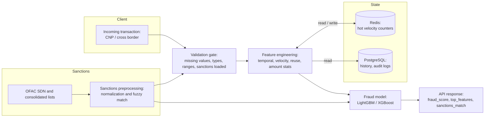

Most cross border payments teams do not lose fraud performance because the model is bad.

They lose performance because **silent data bugs creep in long before the model ever sees the data**, so fraud slips through while dashboards still look “green.”

A missing value rule quietly changes.

A velocity feature returns NaN for first time cards.

A sanctions list fails to load and returns an empty result instead of an error.

The system still “works”.

It just works wrong.

We saw this in our own [research case study](/case-studies/fraud-detection). The very first “fraud case” we caught was not a bad transaction. It was a bug in **our own pipeline**.

---

## **How a simple check caught the first “fraud” in our model**

While building Devbrew’s AI fraud detection and sanctions screening case study for cross border payments, I shipped a tiny helper function that looked completely normal.

No errors.

No warnings.

No obvious issues.

Then I wired in a small validation test on a 1,000-row sample from the IEEE-CIS fraud dataset, which has roughly 590,000 e-commerce transactions and hundreds of anonymized features after joining identity and transaction tables.

That one check broke the helper immediately.

The first “fraud” in the project was not in the card-not-present data.

It was in our own logic.

If we had skipped that test, the bug would have silently corrupted engineered features and pushed bad signal into model training. The model would still train, metrics would still print, and everyone would feel good… until it hit production.

That moment set the tone for the rest of the project.

If this happens in a controlled research repo, it definitely happens inside real payments stacks.

---

## **From one bug to a reusable safety net**

We did not treat that bug as a one-off. We turned it into a pattern.

During data exploration and feature engineering, we built a small validation suite that runs **before** any modeling work. It checks things like:

- **Missing values**
  Required fields are present. Engineered features do not introduce new gaps.
- **Types and ranges**
  Amounts are greater than zero. Probabilities are between 0 and 1. Timestamps actually parse.
- **Row and feature counts**
  The final feature matrix has the shape we expect after merges and drops.
- **Class balance**
  The fraud rate looks sane. For example, ~3–4 percent in IEEE-CIS, ~0.2 percent in PaySim. Not suddenly 20 percent because of a bad filter.
- **Memory footprint**
  Simple casting (like float64 → float32) actually reduces size without breaking anything.

It runs on a sample first, then on the full processed dataset. It is fast, boring, and ruthless.

The impact is simple:

- Silent bugs surface during exploration, not months later when a model is already live.
- Every critical helper function has a clear, testable contract.
- You get reliability without turning your research environment into a process swamp.

For cross border teams living in messy vendor feeds and anonymized fields, this is **cheap insurance against very expensive mistakes**.

Here’s a simplified version of the validation gate we run before any modeling:

```python
def validate_batch(df: "DataFrame") -> None:
    """
    Minimal data quality firewall.
    Fails loud if any core assumption is broken.
    """

    checks = [
        ("missing_values", check_no_missing_critical(df)),
        ("dtypes",          check_feature_dtypes(df)),
        ("ranges",          check_value_ranges(df)),
        ("class_balance",   check_class_balance(df, min_rate=0.001, max_rate=0.1)),
        ("feature_count",   check_feature_count(df, expected=432)),
    ]

    errors = [name for name, ok in checks if not ok]

    if errors:
        # In our pipeline, nothing moves forward if this trips.
        raise ValueError(f"[DATA VALIDATION FAILED] checks failed: {', '.join(errors)}")

# Example stub implementations (pseudo-code):

def check_no_missing_critical(df):
    critical_cols = ["TransactionAmt", "card_id", "isFraud"]
    return df[critical_cols].notnull().all().all()

def check_feature_dtypes(df):
    # Example: ensure engineered features are numeric
    expected_numeric = [col for col in df.columns if col.startswith("fe_")]
    return all(str(df[col].dtype).startswith(("int", "float")) for col in expected_numeric)
```

In practice, this runs on a sample first, then on the full batch. If validate_batch() fails, the job fails loud. Nothing hits feature engineering or model training until the data passes.

---

## **When feature engineering quietly breaks your model**

The IEEE-CIS dataset has almost 600,000 transactions and hundreds of columns. Most of them have missing values. Some have more than 90 percent missing.

In our first pass, 374 out of 394 columns contained missing data. So we made three simple decisions:

1. **Drop the worst offenders**

   A small set of columns with more than 90 percent missing values were removed entirely.

2. **Impute the rest**
   - Numeric columns: median imputation
   - Categorical columns: mode imputation
3. **Validate the result**

   The validation suite confirms the final feature matrix has **zero missing values**.

Then we engineered ten high value features across four groups:

- Temporal patterns (hour of day, day of week)
- Velocity features (transactions per card in 1-hour and 24-hour windows)
- Device and email reuse (multi-accounting / synthetic identity signal)
- Per-card amount statistics (mean, standard deviation for anomaly detection)

The interesting part is how these behave under edge cases.

For example, about 0.58 percent of cards appear **only once**. Any standard deviation on a single transaction will produce NaN.

Our rule:

- For single-transaction cards, set standard deviation to 0 (no variation yet).
- Then validate that **no NaN values remain** in any engineered feature column.

If you skip that thinking, you still get a trained model. The notebook runs fine.

You just have no idea what accuracy you quietly gave up.

---

## **From notebooks to sub-200 ms scoring**

The case study is not just about training a fraud model. It is about returning:

- a fraud risk score
- top contributing features
- and a sanctions result

in **under 200 milliseconds**.

To do that, you have to be honest about what can be recomputed on the fly and what needs memory.

In practice:

- **Velocity features** need recent transaction history per card. That belongs in something like Redis with a clear TTL strategy.
- **Device / email reuse** needs longer-term history and fits better in a database like PostgreSQL.
- **Per-card statistics** can be refreshed in small batches but still require consistent state.

The pattern we lean toward:

- Redis for hot, short-lived features like 1-hour and 24-hour velocity.
- PostgreSQL for colder history and audit logs.
- A simple feature store layer so “this feature” means the same thing across training and inference.

The validation checks still matter here:

- They confirm that stateful features are present and in expected ranges.
- They ensure fallbacks, like “use 0 for truly first-time cards,” are applied consistently.
- They catch broken cache keys or missing sanctions data **before** they turn into “everything looks fine but performance is off.”

At a high level, the architecture looks like this:



---

## **Sanctions screening: the other half of the risk surface**

Fraud is only half the story in cross border payments. The other half is **whether you are allowed to move money at all**.

For this case study, we preprocess OFAC’s Specially Designated Nationals (SDN) list and consolidated lists into a clean table of roughly 39,000 entities across people, companies, vessels, and aircraft.

On top of that we:

- Normalize names and aliases
- Use fuzzy matching so near-matches are still flagged
- Apply country and date filters to cut noise

Here too, a broken pipeline is dangerous.

If the sanctions list fails to load and your code treats that as “no matches,” your false positive rate looks fantastic… right up until a regulator asks why a clearly listed entity sailed straight through your system.

So we validate sanctions data as well:

- Check that we loaded the expected number of entities
- Check that matches always return a score, not a silent None
- Make failures explicit instead of quietly passing

Same principle. A few small checks delete an entire class of stupid, expensive outages.

---

## **What your life looks like when this works**

When these patterns are in place:

- Fraud reviews stop turning into witch hunts on the data team.
- You get fewer late-night “why did the model miss this?” Slack threads.
- Product and risk can trust the scores enough to push harder on approvals.
- Engineers spend more time improving performance, less time chasing ghosts.

You are not chasing perfection.

You are removing the dumb ways to fail, so your fraud model is judged on its actual skill, not silent data chaos.

---

## **What to do this week**

If you run fraud or risk for a cross border product, here is how to put this into practice in the next 7 days.

### 1. **Pick one critical flow**

Choose the flow where a silent bug would really hurt.

- Cross border card-not-present checkout
- Cross border wallet top-up
- Payouts to merchants or partners in multiple countries

Commit to hardening that one flow first.

### 2. **Define your “data quality firewall”**

With your fraud lead and a senior engineer, write down a short list of checks that must never fail silently for that flow.

For example:

- Fraud rate and class balance look sane for that corridor
- No NaN values in production feature vectors
- Velocity and history features behave correctly for first-time cards
- Sanctions data is loaded and fresh

Turn that list into a small validation script that runs on every new dataset or deploy. Make it fail loud.

### 3. Wire it into your existing pipeline

Do not start a platform project. Bolt it onto what you already have.

- In notebooks: run validation at the top before any modeling
- In batch jobs: add a validation step that must pass before training or scoring
- In real-time services: expose a simple health check for feature completeness and sanctions freshness

The goal is not elegance. The goal is to stop shipping broken data.

### 4. Tie it to money

In your next fraud or risk review, show two numbers:

- How many issues the validation gate caught before production
- The fraud loss, false positive churn, or engineering time you avoided

Once leadership sees that a one week silent bug hunt sprint protects real money, it becomes easy to roll this pattern out to other corridors and products.

## Leverage AI for fraud detection

Your fraud model is not failing because the algorithms are bad. It is failing because of silent data bugs your team cannot see.

Devbrew works with cross border payments teams to ship reliable AI fraud models, with validation gates and real time checks that catch more bad actors with fewer data bugs.

If you run fraud or risk for a cross border product, [book a call](/get-started) with us. We will review your current pipeline and share a 7 day plan to put these patterns in place.
